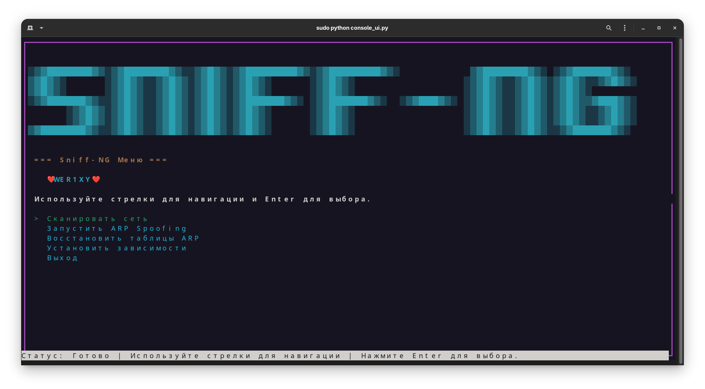

# Sniff-NG

> **Powerful Python tool for network scanning, ARP spoofing, and local network MITM attacks with TUI interface.**

[](LICENSE)
[](https://www.python.org/)



---

**Tags:**  
`network` `arp-spoofing` `mitm` `sniffer` `ethical-hacking` `pentest` `python` `security` `tui` `linux` `local-network` `network-scanner` `infosec` `hacking-tool`

---

## About

**Sniff-NG** is a Python tool for network security testing.  
It provides fast local network device scanning, ARP spoofing (MITM), and a fully interactive TUI menu.  
Supports multiple Linux distributions and automatic dependency installation.

---

## Features

- **TUI interface:** no command line needed
- **Network scanner:** find all devices in the local network
- **ARP spoofing / MITM:** easy attack launch via menu
- **Restore ARP tables:** clean up after attacks
- **One-click dependency install:** works on Ubuntu, Debian, Arch, Fedora, CentOS, etc.
- **Python 3.8+** compatible

---

## Requirements

- Linux OS (Debian, Ubuntu, Arch, Fedora, CentOS, etc.)
- Python 3.8+
- Tools: `arp-scan`, `dsniff`
- Python libraries: `scapy`, `mitmproxy`

---

## Installation

```bash
git clone https://github.com/Secret297-CODER-SOURCE/Sniff-NG.git
cd Sniff-NG
sudo python3 console_ui.py
```
> **Run with `sudo`!**  
> Most features require root privileges for network access.

If dependencies are missing, select "Install dependencies" in the TUI menu.

---

## Usage

All features are available via the TUI menu:
- **Network Scan:** shows all connected devices
- **ARP Spoofing:** attack any target/gateway on your LAN
- **Restore ARP:** cleans up ARP tables
- **Install dependencies:** one-click setup

**Controls:**  
- Up/Down: navigate  
- Enter: select  
- Hints at the bottom


---

## Security Notice

- For **educational and authorized penetration testing only**!
- Do not use against networks you do not own or have explicit permission to test.

---

## Contributing

Pull requests are welcome!  
Please open issues for bugs, ideas, or feature requests.

